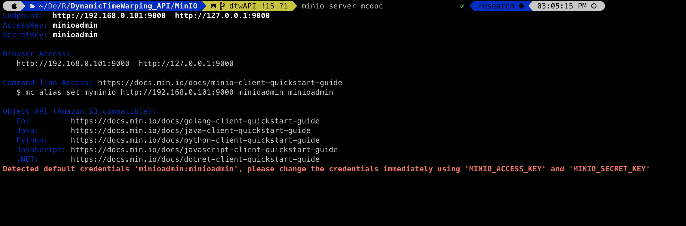
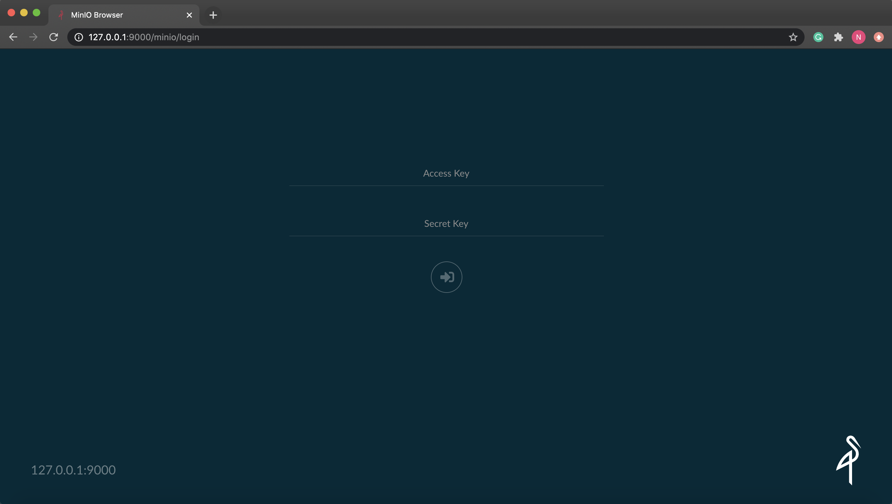

# Table of Content

* [Dataset](#Dataset)
* [Dynamic Time Warping](#Dynamic-time-Warping)
* [MinIO](#Minio)
  * [What is MinIO](#what-is-minio)
  * [How to use MinIO](#how-to-use-minio)
  * [Create a bucket](#create-a-bucket)
  * [Upload files](#upload-files)
* [Flask](#flask)
  * [Custom HTML file](#custom-html-files)
* [FastDTW](#fastdtw)


## Dataset

This dataset consist of ASL (American Sign Language) data points where we keep track of the dominant position on an x-y plane.

Both Train and test data set follow the same convention with each example separated by "-------" lines.

Here is an example image taken from the data set.

<INSERT IMAGE HERE>

The first line we have contains a unique Object ID that is consistent over all the dataset as a whole.

The second line contains how many class labels are there. In total there are (NEED FIGURE HERE)

The third line contains what does the sign mean.

The fourth line is empty and starting from the fifth line, we have our coordinate points.

<INSERT THE IMAGES OF SIGN LANGUAGE PHOTS>

Each training/test example can have different number of data/coordinate points.


## Dynamic Time Warping

According to Wikipedia:
>Dynamic time warping (DTW) is one of the algorithms for measuring similarity between two temporal sequences, which may vary in speed. For instance, similarities in walking could be detected using DTW, even if one person was walking faster than the other, or if there were accelerations and decelerations during the course of an observation. DTW has been applied to temporal sequences of video, audio, and graphics data — indeed, any data that can be turned into a linear sequence can be analyzed with DTW. A well known application has been automatic speech recognition, to cope with different speaking speeds. Other applications include speaker recognition and online signature recognition. It can also be used in partial shape matching application.


We use Dynamic Time warping to recognise what sign language word we have since in a real world scenario we can have cameras that capture the video at different fps or frames per seconds which can lead us having more or less frames through which we actually collect the data points. We can also use this to use our model in different online videos as well, given the desired conditions are met.

This dataset is taken from [Dr. Vassilis Athitsos's Machine Learning class website](http://vlm1.uta.edu/~athitsos/courses/cse4309_fall2020/assignments/dtw/)

## MinIO

### What is MinIO

MinIO is a free open source Kubernetes Native,High PerformanceObject Storage. You can learn more on their website [here](https://min.io/)

## How to use MinIO

The first thing to do in order to use MinIO is to install it.

To install MinIO, follow this steps:

If you are a MacOS user:

```console
foo@bar:~$ brew install minio/stable/minio

foo@bar:~$ brew install minio/stable/mc

foo@bar:~$ pip3 install minio


```
This will download both the client and server side of MinIO

After doing this, we can start using MinIO

To activate the MinIO server, run the following command in your terminal window:

```console
foo@bar:~$ minio server mcdoc

```

Here mcdoc is just a folder that will be created in your system where Minio will be storing all its data.

Please note that this guide is for using MinIO and this project on our local machine only, different services may have different way of dealing with it. You can always refer to their [website](https://docs.min.io/docs/minio-quickstart-guide.html) for more details

After doing the above step, you should see certain things printed out on your terminal screen. It should look something like this:

<p align="center">
  
</p>

After getting the information, the first thing that we need to do is go to the IP address that is mentioned in the terminal window.

After going to the mentioned IP address, in my case http://127.0.0.1:9000, we will see a login screen.

<p align="center">
  
</p>

After seeing this, we need to now copy the Access Key and secret key, that we see on the terminal window

After entering those credentials, you can now login and see the main MinIO website. In this website we can navigate around to see what everything does.

### Create a bucket
To create a bucket, you can click on the plus sign that is there on the bottom right corner. After clicking that you will see two options, one is to create a bucket and the other is to upload a file. Create two bucket, the first one should be names test and the other one should be named output_bucket.

<INSERT IMAGE HERE >

### Upload files

To upload file in a particular bucket, you can go to that bucket which will appear on the left side of the browser after you have created that. Navigate to the bucket and then click on the plus sign again to go to the upload option. Here now we can upload the files that we want.

Go on to the test bucket and upload the data set which can be found [here](https://github.com/nisargushah/DynamicTimeWarping_API/tree/main/dataset)

You can find more information on MinIO from their [documentation](https://docs.min.io/)


## Flask

Flask is a micro web framework written in Python. It is classified as a microframework because it does not require particular tools or libraries. We are going to use Flask for this project because it is relatively easy to code in and also it is very light weight.

### Custom HTML file

We have a vanilla HTML file that just displays the total accuracy of the model on to a webpage.
You can change that by going on to the templates sub-folder in the flask folder.

More information on Flask can be found on their [website](https://flask.palletsprojects.com/en/1.1.x/)

## FastDTW

We will be using FastDTW for the implementation of Dynamic Time Warping. More information can be found [here](https://github.com/slaypni/fastdtw)
